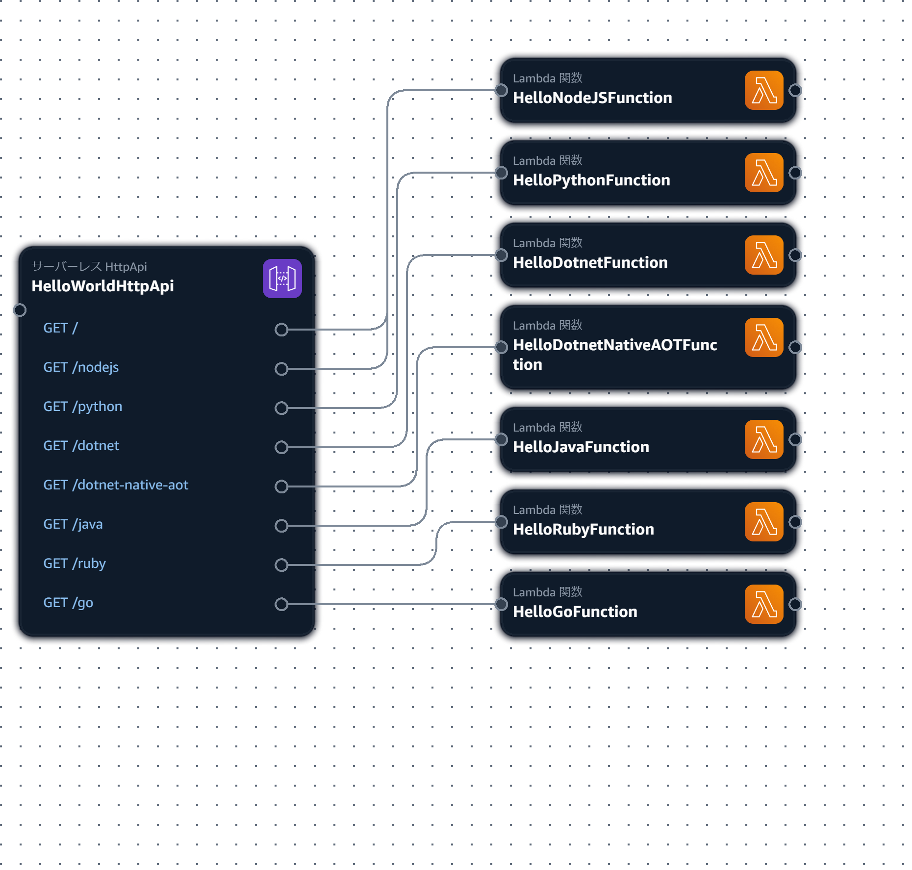

# aws_sam_httpapi_hello_world2

## 概要
* AWS SAM を使ってシンプルな API Gateway HTTP API を構築する。
* AWS SAM CLI などの実行環境を VSCode の Dev Containers で構築する。
* NodeJS 以外にも Python, .NET, Java, Ruby, Go で Lambda 関数を作成してみる。
* 前回: [aws_sam_httpapi_hello_world](https://github.com/Tobotobo/aws_sam_httpapi_hello_world)

  


## 環境情報
```
$ cat /etc/os-release | grep PRETTY_NAME
PRETTY_NAME="Ubuntu 24.04.2 LTS"

$ docker --version
Docker version 28.0.1, build 068a01e
```

## 詳細

### 目次
* [開発コンテナの起動](#開発コンテナの起動)
* [API Gateway のビルド・実行](#api-gateway-のビルド実行)
* [NodeJS のビルド・実行](#nodejs-のビルド実行)
* [Python のビルド・実行](#python-のビルド実行)
* [.NET のビルド・実行](#net-のビルド実行)
* [Java のビルド・実行](#java-のビルド実行)
* [Ruby のビルド・実行](#ruby-のビルド実行)
* [Go のビルド・実行](#go-のビルド実行)
* [デプロイ](#デプロイ)
* [スタックを削除](#スタックを削除)

### 開発コンテナの起動
* Docker が必要。
* インストールしていない場合は VSCode の拡張機能の `Remote Development` をインストールする。
* VSCode でフォルダを開いた際に以下のメッセージが表示された場合は、コンテナーで再度開く をクリックする。  
  
* 表示されない場合は `Ctrl + Shift + P` または画面上部の検索から コマンドの表示と実行 をクリックする。  
  
* 開発コンテナー: コンテナーで再度開く をクリック  
  ※初回はコンテナのビルドで少し時間がかかります。  
    
    

### API Gateway のビルド・実行
ビルド
```
sam build --use-container
```
起動
```
sam local start-api
```
* http://127.0.0.1:3000/
* http://127.0.0.1:3000/nodejs
* http://127.0.0.1:3000/python
* http://127.0.0.1:3000/dotnet
* http://127.0.0.1:3000/java
* http://127.0.0.1:3000/ruby
* http://127.0.0.1:3000/go

留意点
* ブラウザから URL を叩くと、その URL に対応する Lambda 関数が都度 Docker で実行され結果が返される。
* 最後に `sam build` した結果で実行される。  
  ※起動したまま `sam build` しても反映されない。再度 `sam local start-api` が必要。

### NodeJS のビルド・実行
ビルド
```
sam build --use-container HelloNodeJSFunction
```
実行
```
sam local invoke HelloNodeJSFunction
```

### Python のビルド・実行
ビルド
```
sam build --use-container HelloPythonFunction
```
実行
```
sam local invoke HelloPythonFunction
```

### .NET のビルド・実行
ビルド
```
sam build --use-container HelloDotnetFunction
```
実行
```
sam local invoke HelloDotnetFunction
```
留意点
* .NET のビルドは `--mount-with WRITE` をつけないと、毎回 `Would you like to enable mounting with write permissions?  [y/N]:` と確認メッセージが表示される。  
  デフォルトで src は読み取り専用でマウントされるが、.NET は bin や obj を出力するため書き込み許可が求められるものと思われる。 
* `--mount-with WRITE` を付けても解消するが、結論から言うと `Makefile` を書いた方がよい。  
  Java などこれを付けるとエラーになるものがあり、デプロイ前に全関数を一括でビルドする際、関数ごとに `--mount-with WRITE` は指定できないため、あちらを立てればこちらが立たずで詰んでしまう。　　
* 一応、`--cache` を工夫して関数を個別にビルドするか、個別にビルドした結果を手動でマージすることで回避できるが、運用が煩雑になるのと、`--cache` の場合は公式の注記でサードパーティーモジュールのバージョン変更など変更として検知されない要素もあるので注意が必要である。
* `Makefile` で対応する場合は、`template.yaml` に以下を追記しソースと一緒に `Makefile` を配置する。  
  ```yaml
  Metadata:
    BuildMethod: makefile
  ```
* Infrastructure Composer が生成した dotnet8 のテンプレでは、`Handler: bootstrap` になっているが実行すると `Error: executable assembly /var/task/bootstrap.dll or binary /var/task/bootstrap not found.` になる。  
  `Handler: Function::Function.Function::FunctionHandler` に修正する。  
  ※`Handler: DLLファイル名::名前空間.クラス名::メソッド名`

### Java のビルド・実行
ビルド
```
sam build --use-container HelloJavaFunction
```
実行
```
sam local invoke HelloJavaFunction
```
留意点
* Java のビルドで `--mount-with WRITE` をつけると Gradle が `Failed to load native library 'libnative-platform.so' for Linux amd64.` エラーになってビルドできない。
* Infrastructure Composer が生成した java21 のテンプレでは、実行時に Handler が見つからず `java.lang.ClassNotFoundException` が発生する。  
  テンプレは無名パッケージになっているが、どうやっても無名パッケージのままでは Handler が見つけられないので、Handler.java に `package awslambda.javagradle;` を追加し、template.yaml は `Handler: awslambda.javagradle.Handler::handler` にしてパッケージ名を明示する。

### Ruby のビルド・実行
ビルド
```
sam build --use-container HelloRubyFunction
```
実行
```
sam local invoke HelloRubyFunction
```
留意点
* Infrastructure Composer が生成した ruby3.3 のテンプレでは、`Handler: index.handler` になっているが実行すると `cannot load such file -- index` になる。  
  `Handler: function.handler` に修正する。  

### Go のビルド・実行
ビルド
```
sam build --use-container HelloGoFunction
```
実行
```
sam local invoke HelloGoFunction
```
留意点
* Go による Lambda 関数の構築  
  https://docs.aws.amazon.com/ja_jp/lambda/latest/dg/lambda-golang.html  
  > Go は、他のマネージドランタイムとは異なる方法で実装されています。Go は実行可能バイナリにネイティブにコンパイルするため、専用の言語ランタイムは必要ありません。Go 関数を Lambda にデプロイするには、OS 専用ランタイム (provided ランタイム ファミリ) を使用します。  
* `Runtime: provided.al2023` でどうやって Go をビルドするのかと思ったら `Runtime: provided.al2023` には Go が入ってるっぽい。  
  AL2023 での Go  
  https://docs.aws.amazon.com/ja_jp/linux/al2023/ug/go.html  
  > AL2023 Go で独自のコードを作成したい場合は、AL2023 Go に含まれているツールチェーンを使用できます。  

### デプロイ

AWS への接続確認
```
aws sts get-caller-identity
```
※`.env` を使用する場合
* `.env.template` をコピーし `.env` にリネームする。
* `.env` に接続情報を記述する。
* `set -a; source .env; set +a;` を実行し現在のシェルに `.env` を環境変数として読み込む。

ビルド
```
sam build --use-container
```
デプロイ
```
sam deploy \
    --stack-name httpapi-hello-world2 \
    --region ap-northeast-1 \
    --capabilities CAPABILITY_IAM \
    --no-disable-rollback \
    --resolve-s3
```

### スタックを削除
```
sam delete --stack-name httpapi-hello-world2
```
